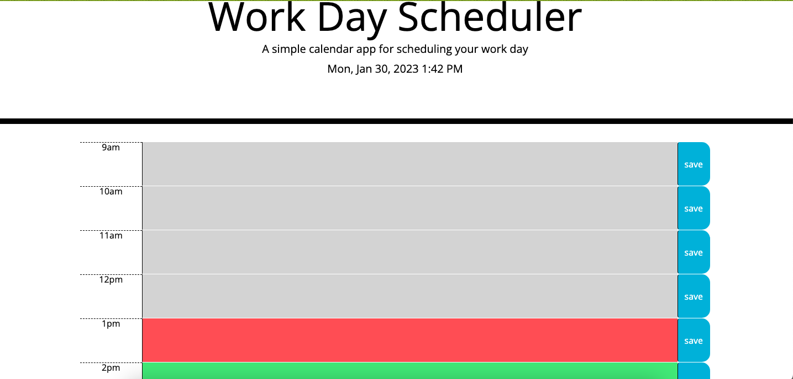
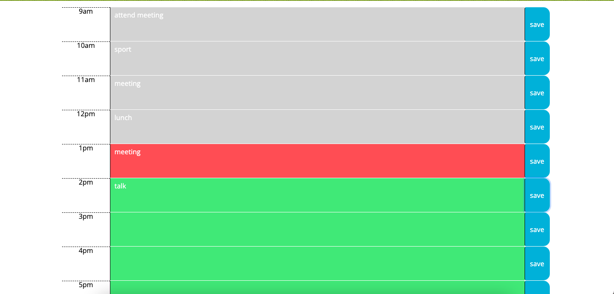
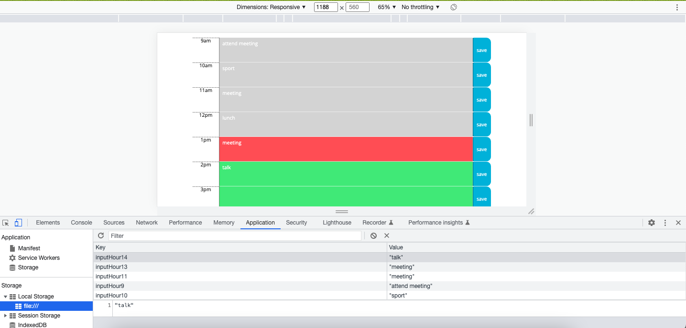
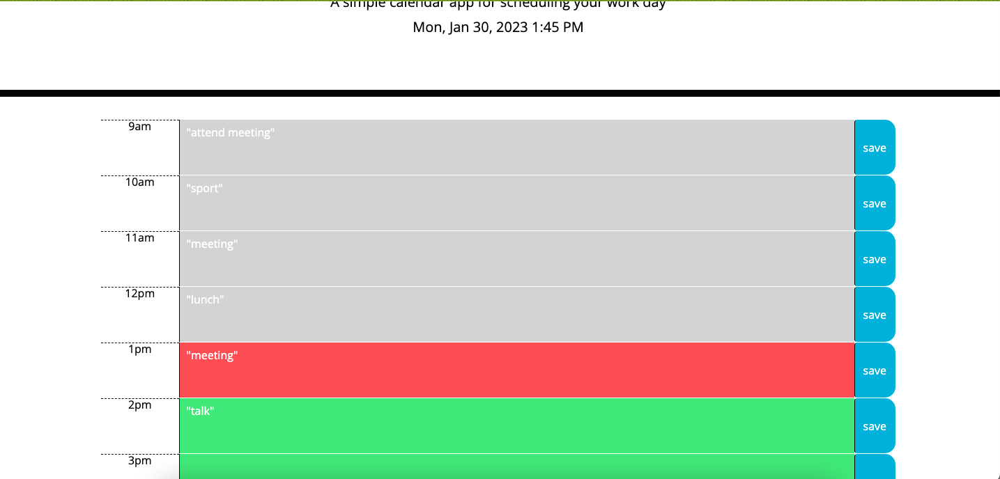

# Daily-Planner

## It's a code create a simple calendar application that allows a user to save events for each hour of the day. contains the following requirements:

## It contains the following requirements:

* Display the current day at the top of the calender when a user opens the planner.
* Present timeblocks for standard business hours when the user scrolls down.
* Color-code each timeblock based on past, present, and future when the timeblock is viewed.
* Allow a user to enter an event when they click a timeblock.
* Save the event in local storage when the save button is clicked in that timeblock.
* Persist events between refreshes of a page.
  

 
## There are some screenshots

## This is the link
*  https://joy-hui.github.io/Quiz/

